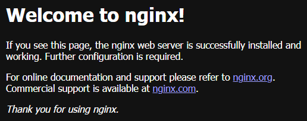
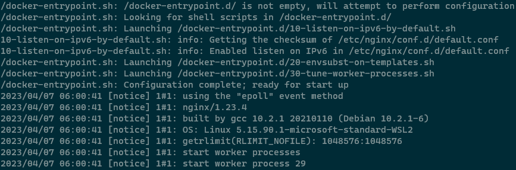
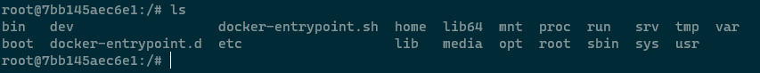
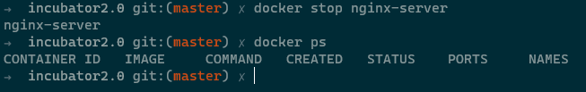

## 1. Start an nginx container, port forward to local and check

```
docker run --name nginx-server -p 8085:80 -d nginx
```



## 2. Check logs

```
docker logs nginx-server
```



## 3. Go inside the container

```
docker exec -it nginx-server bash
```



## 4. Stop the container

```
docker stop nginx-server
```


