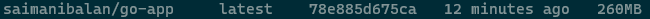
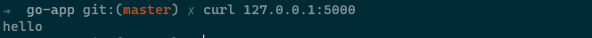
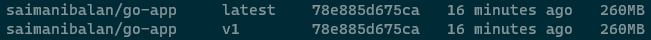
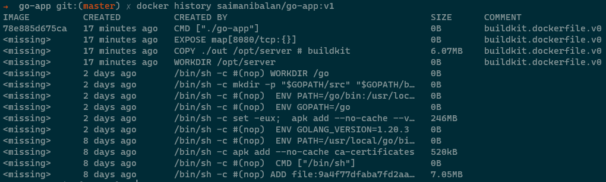
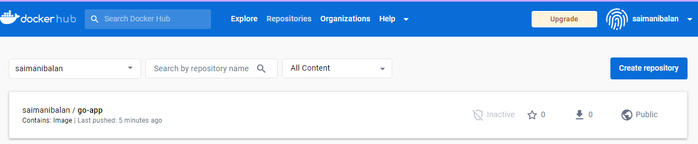

## 1. Try to create a docker image from base image golang-alpine

```
FROM golang:alpine

WORKDIR /opt/server

COPY ./out /opt/server

EXPOSE 8080

CMD ["./go-app"]

```

Copied binary from docker-ninja/go-app

```
docker build . -t saimanibalan/go-app
```



## 2. Run a container with that image and do a curl request

```
docker run -d -p 5000:8080 saimanibalan/go-app
```



## 3. Tag the docker image with v1

```
docker image tag saimanibalan/go-app saimanibalan/go-app:v1
```



## 4. Run docker history, observe and understand

```
docker history saimanibalan/go-app:v1
```



## 5. Push docker image to dokerhub

```
docker push saimanibalan/go-app:v1
```


