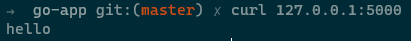

## 1. Create multi-stage build and run dockerfile

```
FROM golang as build-go
WORKDIR /opt/build
COPY . /opt/build
RUN make build-deps
RUN make build-linux

FROM golang:alpine
WORKDIR /opt/server
COPY --from=build-go /opt/build/out /opt/server
EXPOSE 8080
CMD ["./go-app"]
```

```
docker build . -t saimanibalan/go-app && \
docker run -d -p 5000:8080 saimanibalan/go-app
```


