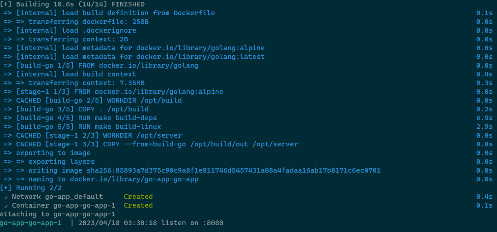
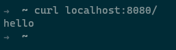
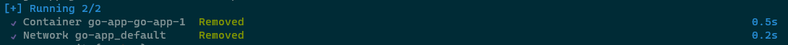

## 1. Create docker compose file for go app

Dockerfile for go app in working directory

```
FROM golang as build-go
WORKDIR /opt/build
COPY . /opt/build
RUN make build-deps
RUN make build-linux

FROM golang:alpine
WORKDIR /opt/server
COPY --from=build-go /opt/build/out /opt/server
EXPOSE 8080
CMD ["./go-app"]
```

Docker compose file in working directory

```
version: "3"
services:
  go-app:
    build: ./
    ports:
      - 8080:8080
```

## 2. Docker compose up

```
docker compose up
```



## 3. Use / endpoint to check the service running



## 4. Docker compose down

```
docker compose down
```


