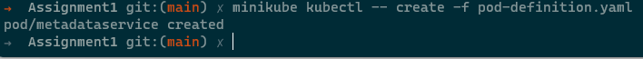
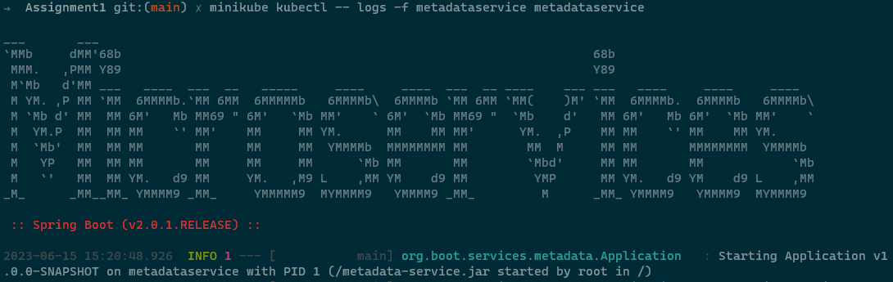
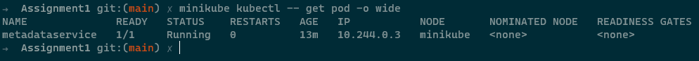
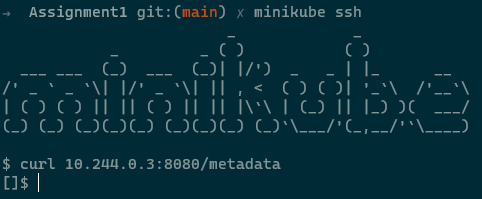
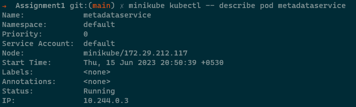
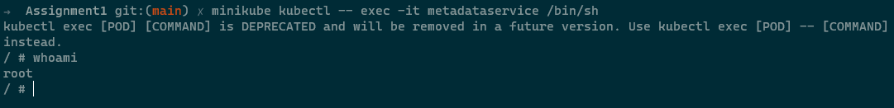

## 1. Create a Pod specification for the metadataservice

```
kubectl create -f pod-definition.yaml
```



## 2. Check the logs

```
kubectl logs -f metadataservice metaservice
```



## 3. Check the Pod IP

```
kubectl describe pod metadataservice
```



## 4. Hit the POD ip with /metadata url path

```
minikube ssh
curl http://10.244.0.3:8080/
```



## 5. Describe the POD

```
kubectl describe pod metadataservice
```



## 6. Exec into the container using /bin/sh command

```
kubectl exec -it metadataservice  /bin/sh
```


