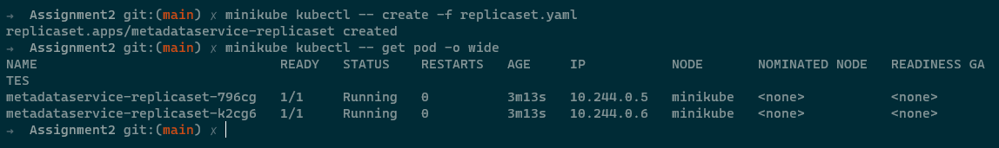
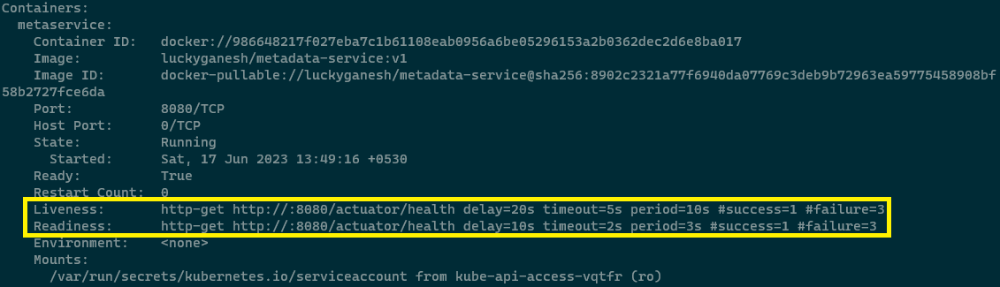
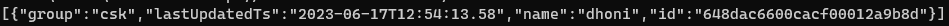

## 1 . Create ReplicaSet for the MetadataService and deploy in K8 cluster

```
kubectl create -f replicaset.yaml
```



## 2 . Add livelinessProbe and readinessProbe using spring actuator's /actuator/health endpoint

```
kubectl describe pod metadataservice-replicaset-796cg
```



## 3. Post to create a meta entry in the database

```
minikube ssh

curl --header "Content-Type: application/json" --request POST --data '{"group":"csk","name":"dhoni","value":"high"}' http://10.244.0.4.:8080/metadata
```


## 4. Get all meta entry posted

```
minikube ssh

curl http://10.244.0.4:8080/metadata

```


