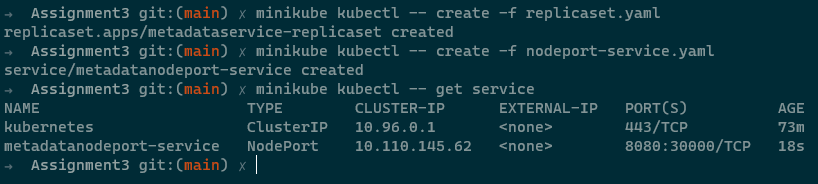
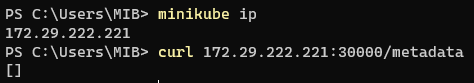
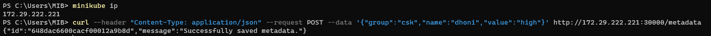
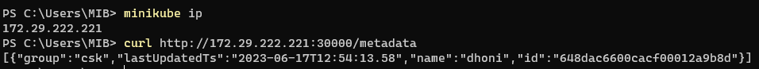

## 1. Create NodePort service for the metadataservice and access via nodeport from host machine

```
kubectl create -f replicaset.yaml
kubectl create -f nodeport-service.yaml

kubectl get service
```




## 2. POST to create an meta entry in the database

```
curl --header "Content-Type: application/json" --request POST --data '{"group":"csk","name":"dhoni","value":"high"}' http://172.29.222.221:30000/metadata
```



## 3. GET all meta entry posted

```
curl http://172.29.222.221:30000/metadata
```


