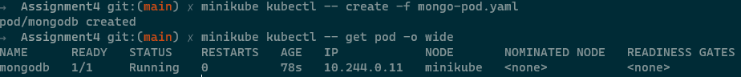
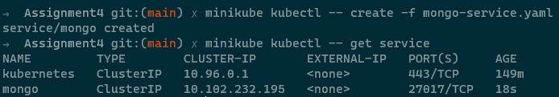
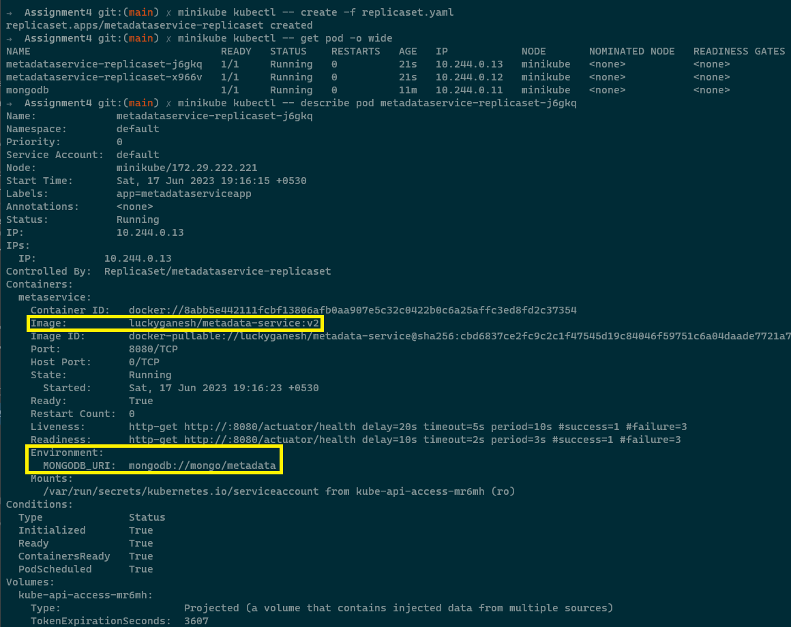
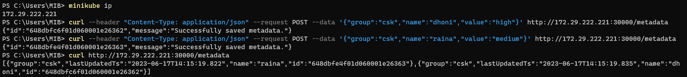
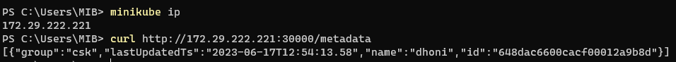

## 1. Deploy new Pod using mongodb image

```
kubectl create -f mongo-pod.yaml
```



## 2. Create ClusterIP service for mongodb with service name mongo

```
kubectl create -f mongo-service.yaml
```



## 3. Change image in MetadataService, pass mongo connection URI as env variable

```
kubectl create -f replicaset.yaml
kubectl create -f nodeport-service.yaml
```



## 4. Try again POST and GET for metadataservice

```
 curl --header "Content-Type: application/json" --request POST --data '{"group":"csk","name":"dhoni","value":"high"}' http://172.29.222.221:30000/metadata

 curl --header "Content-Type: application/json" --request POST --data '{"group":"csk","name":"raina","value":"medium"}' http://172.29.222.221:30000/metadata
```



```
curl http://172.29.222.221:30000/metadata
```


