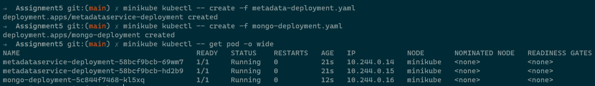

## 1. Create Deployment object for MetadataService and Mongo database

```
kubectl create -f metadata-deployment.yaml
kubectl create -f mongo-deployment.yaml
kubectl create -f nodeport-service.yaml
kubectl create -f mongo-service.yaml
```


