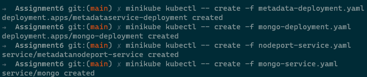
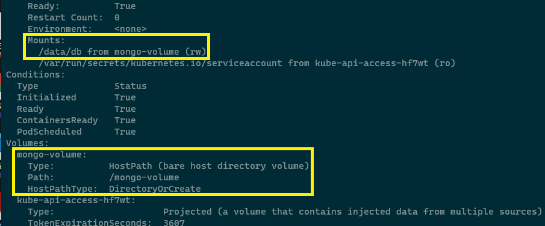
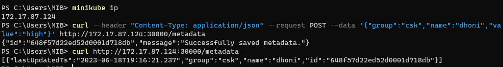
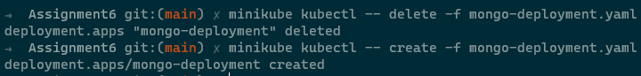
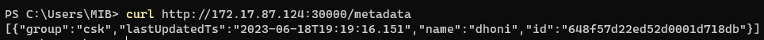

## 1. Run mongo database with persistent volume using hostpath

```
kubectl create -f metadata-deployment.yaml
kubectl create -f mongo-deployment.yaml
kubectl create -f nodeport-service.yaml
kubectl create -f mongo-service.yaml
```



## 2. Custom data folder path should /data/db

```
kubectl describe pod mongo-deployment-5979579c66-hzgz9
```



## 3. Delete and recreate mongoDB pod and see no data loss

```
minikube ip

curl --header "Content-Type: application/json" --request POST --data '{"group":"csk","name":"dhoni","value":"high"}' http://172.17.87.124:30000/metadata


curl http://172.17.87.124:30000/metadata
```



```
kubectl delete -f mongo-deployment.yaml

kubectl create -f mongo-deployment.yaml

curl http://172.17.87.124:30000/metadata
```



