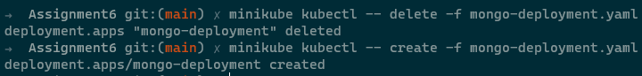

## 1. Run mongo db with persistent volume using pv and pvc

```
kubectl create -f metadata-deployment.yaml
kubectl create -f nodeport-service.yaml
kubectl create -f mongo-persistent-volume.yaml
kubectl create -f mongo-persistent-volume-claim.yaml
kubectl create -f mongo-deployment.yaml
kubectl create -f mongo-service.yaml
```


## 2. Use hostpath to define pv

```
kubectl describe pod mongo-deployment-586c56d855-b847g
```


## 3. Delete and Recreate mongo db and see no data loss

```
minikube ip

curl --header "Content-Type: application/json" --request POST --data '{"group":"csk","name":"dhoni","value":"high"}' http://172.17.87.124:30000/metadata


curl http://172.17.87.124:30000/metadata
```


```
kubectl delete -f mongo-deployment.yaml

kubectl create -f mongo-deployment.yaml

curl http://172.17.87.124:30000/metadata
```



