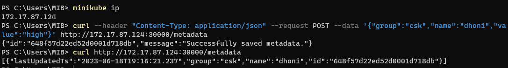

# Use env mongo URL instead of hardcoding on yaml

## 1. Create a configmap for mongo configuration url and use it in metadata service

```
kubectl create -f mongo-config-map.yaml
kubectl create -f mongo-persistent-volume.yaml
kubectl create -f mongo-persistent-volume-claim.yaml
kubectl create -f mongo-deployment.yaml
kubectl create -f mongo-service.yaml
kubectl create -f metadata-deployment.yaml
kubectl create -f nodeport-service.yaml
```

```
kubectl describe pod metadataservice-deployment-7fd678d8bf-65hf4
```


```
minikube ip

curl --header "Content-Type: application/json" --request POST --data '{"group":"csk","name":"dhoni","value":"high"}' http://172.17.87.124:30000/metadata


curl http://172.17.87.124:30000/metadata
```



```
kubectl delete -f mongo-deployment.yaml

kubectl create -f mongo-deployment.yaml

curl http://172.17.87.124:30000/metadata
```


