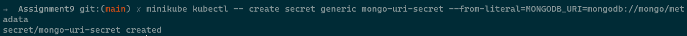
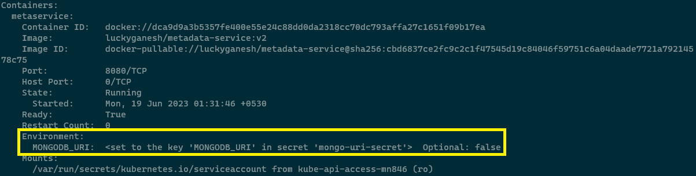
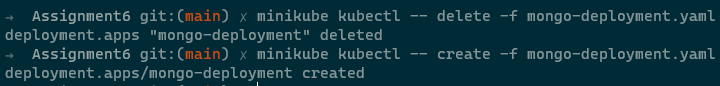
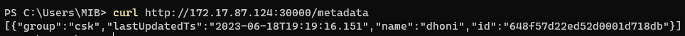

# Use a secret mongo URL in metadata service

## 1. Create a secret object with mongo configuration url and pass it as env to metadata service

```
kubectl create secret generic mongo-uri-secret --from-literal=MONGODB_URI=mongodb://mongo/metadata
```



```
kubectl create -f mongo-persistent-volume.yaml
kubectl create -f mongo-persistent-volume-claim.yaml
kubectl create -f mongo-deployment.yaml
kubectl create -f mongo-service.yaml
kubectl create -f metadata-deployment.yaml
kubectl create -f nodeport-service.yaml
```

```
kubectl describe pod metadataservice-deployment-6bd4d7dc88-9ggrp
```



```
minikube ip

curl --header "Content-Type: application/json" --request POST --data '{"group":"csk","name":"dhoni","value":"high"}' http://172.17.87.124:30000/metadata


curl http://172.17.87.124:30000/metadata
```


```
kubectl delete -f mongo-deployment.yaml

kubectl create -f mongo-deployment.yaml

curl http://172.17.87.124:30000/metadata
```



